# BÀI TẬP 1

Bài tập thực hành quá trình cài đặt, cấu hình Git và kết nối với GitHub, sau đó triển khai hệ thống trên Ubuntu Linux thông qua VMware. Nội dung thực hiện bao gồm cài đặt Docker Compose, triển khai các dịch vụ Nginx, Node-RED, MariaDB, phpMyAdmin, cấu hình Cloudflare Tunnel và thiết lập Nginx để chạy hai website với hai tên miền khác nhau.

## Cài đặt và cấu hình Git/GitHub

Kiểm tra phiên bản Git đã được cài đặt trên máy:

```bash
git --version
```

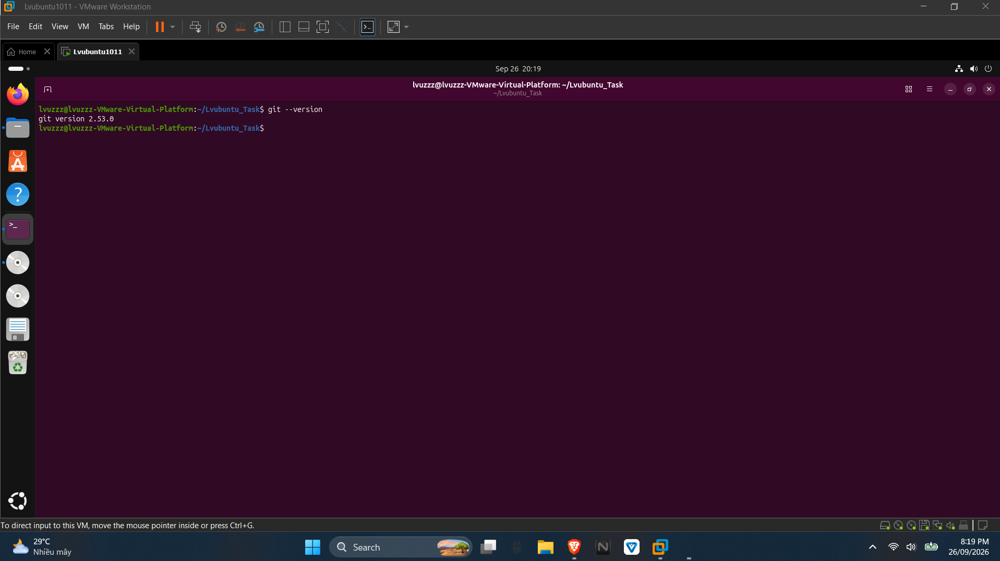

Kiểm tra tên người dùng Git đã cấu hình:

```bash
git config --global user.name
```

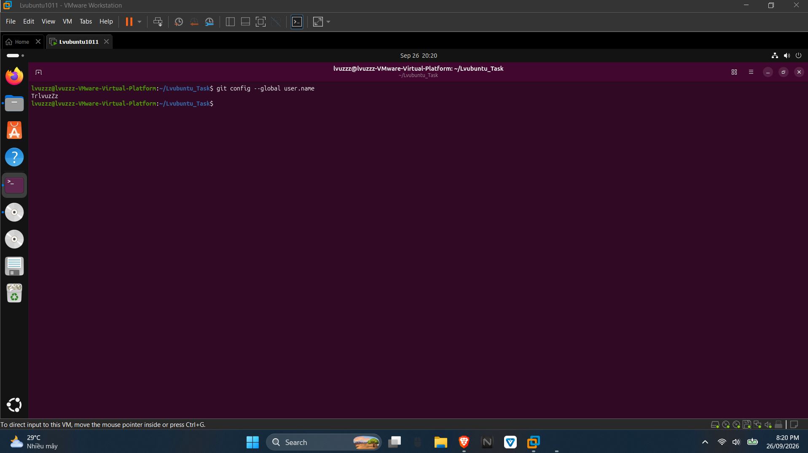

Kiểm tra email được sử dụng cho Git:

```bash
git config --global user.email
```

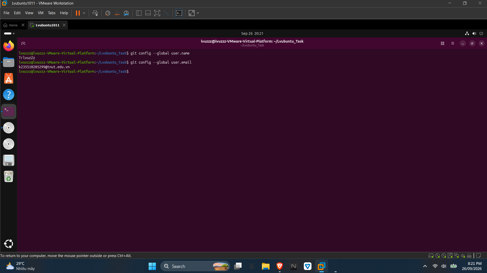

Kiểm tra kết nối SSH với tài khoản GitHub:

```bash
ssh -T git@github.com
```

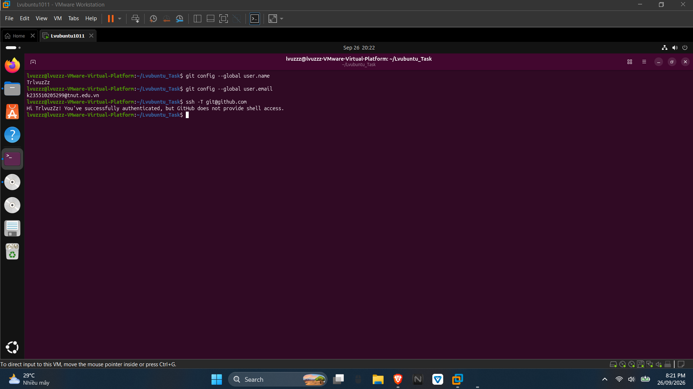

Kiểm tra các thông tin cấu hình Git hiện tại:

```bash
git config --global --list
```

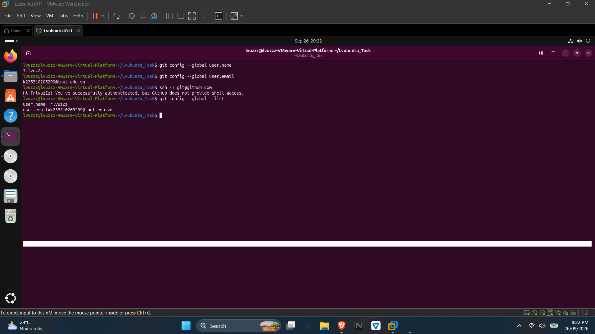

## 1. Giả lập hệ điều hành Linux

Sử dụng **VMware Workstation** để tạo máy ảo và cài đặt hệ điều hành **Ubuntu Linux**.

### Kiểm tra phiên bản hệ điều hành

```bash
cat /etc/os-release
```

Kết quả Ubuntu đã được cài đặt và hoạt động trên VMware:

<p align="center">
  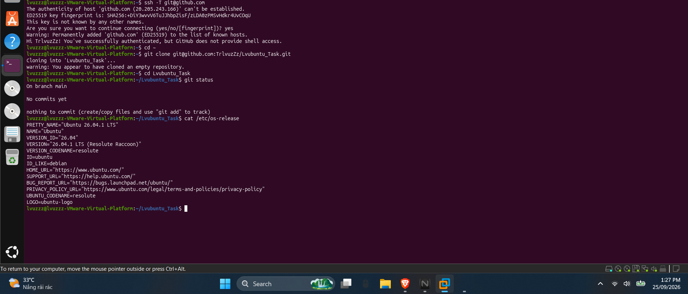
</p>

---

## 2. Cài đặt Docker Compose trên Ubuntu

Cập nhật danh sách các gói phần mềm:

```bash
sudo apt update
```

Cài đặt Docker và Docker Compose:

```bash
sudo apt install docker.io docker-compose-v2 -y
```

### Kiểm tra phiên bản

```bash
docker --version
docker compose version
```

Kết quả Docker và Docker Compose đã được cài đặt thành công:

<p align="center">
  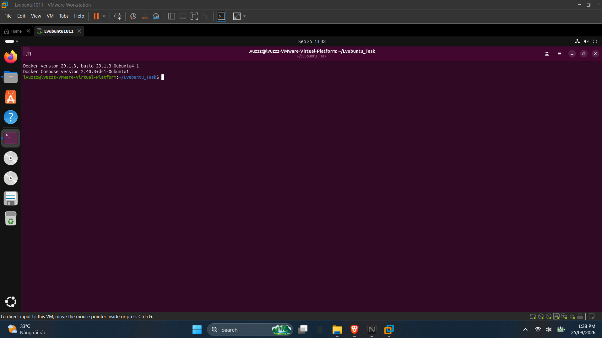
</p>
---

## 3. Triển khai các dịch vụ bằng Docker Compose

Sử dụng Docker Compose để triển khai các dịch vụ cần thiết cho hệ thống gồm **Nginx, Node-RED, MariaDB và phpMyAdmin**. Cloudflared sẽ được cấu hình ở bước tiếp theo.

### 3.1. Khởi chạy các dịch vụ

Các dịch vụ được cấu hình trong file:

```text
compose.yaml
```

Khởi chạy toàn bộ container:

```bash
docker compose up -d
```

Kiểm tra trạng thái hoạt động:

```bash
docker compose ps
```

Kết quả cho thấy các container **Nginx, Node-RED, MariaDB và phpMyAdmin** đã được khởi chạy thành công.

<p align="center">
  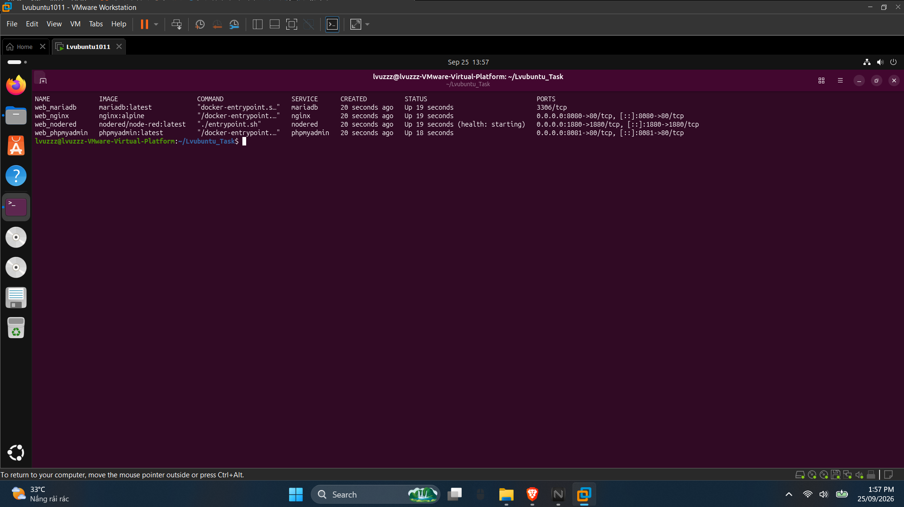
</p>

### 3.2. Kiểm tra Nginx

Nginx được sử dụng làm Web Server và chạy trên cổng `8080`.

Truy cập:

```text
http://localhost:8080
```

Kết quả cho thấy Nginx đã hoạt động và có thể phục vụ nội dung website.

<p align="center">
 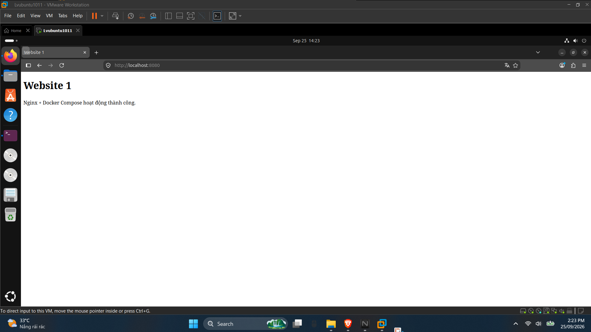
</p>

### 3.3. Kiểm tra Node-RED

Node-RED được triển khai bằng Docker Compose và chạy trên cổng `1880`.

Truy cập:

```text
http://localhost:1880
```

Giao diện Node-RED sau khi khởi động thành công:

<p align="center">
  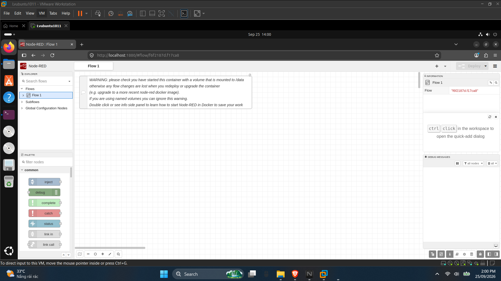
</p>

### 3.4. Kiểm tra MariaDB và phpMyAdmin

MariaDB được sử dụng để lưu trữ và quản lý dữ liệu. phpMyAdmin cung cấp giao diện web giúp quản lý cơ sở dữ liệu MariaDB.

phpMyAdmin được chạy trên cổng `8081`.

Truy cập:

```text
http://localhost:8081
```

Sau khi đăng nhập, phpMyAdmin kết nối thành công với MariaDB và có thể truy cập cơ sở dữ liệu đã cấu hình.

<p align="center">
  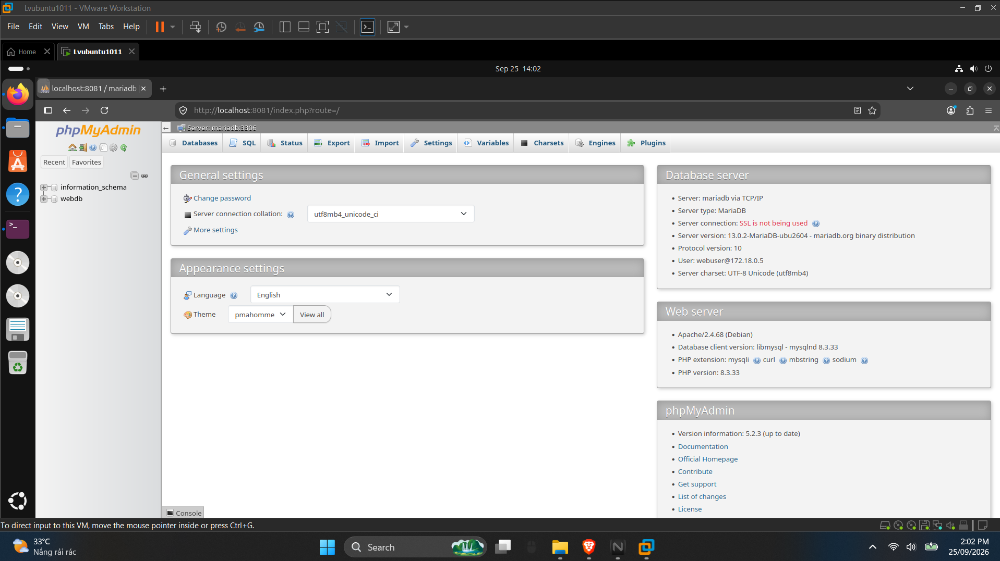
</p>

### 3.5. Cấu hình Cloudflare và tên miền

Cloudflare được sử dụng để quản lý tên miền và tạo Tunnel, giúp website đang chạy trên máy ảo Ubuntu có thể được truy cập từ Internet mà không cần mở trực tiếp cổng trên router.

#### 3.5.1. Đăng ký tên miền

Tên miền được sử dụng cho hệ thống là:

```text
l4mvu.id.vn
```

Sau khi đăng ký và kích hoạt thành công, tên miền được hiển thị trong trang quản lý của nhà cung cấp.

<p align="center">
  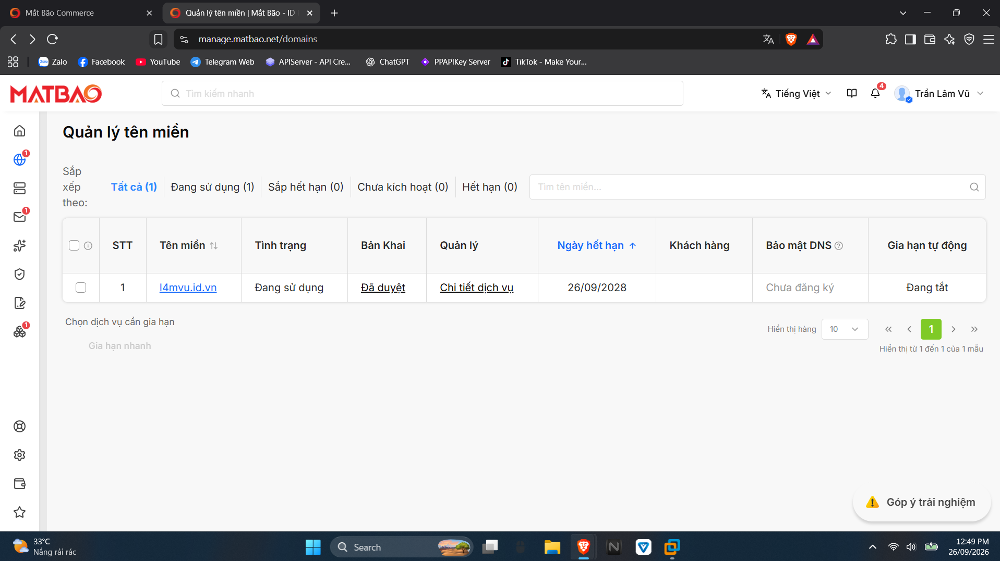
</p>

#### 3.5.2. Cấu hình Nameserver trên Cloudflare

Tên miền `l4mvu.id.vn` được thêm vào Cloudflare. Sau đó Cloudflare cung cấp hai Nameserver để thay thế Nameserver mặc định của nhà cung cấp tên miền:

```text
lucy.ns.cloudflare.com
quentin.ns.cloudflare.com
```

<p align="center">
  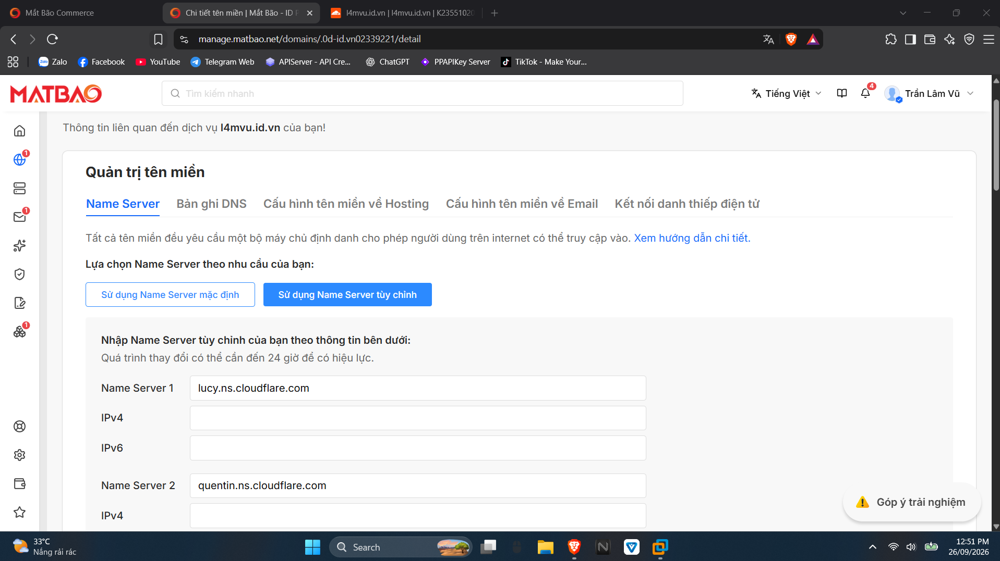
</p>

Sau khi thay đổi Nameserver và Cloudflare xác nhận thành công, tên miền chuyển sang trạng thái hoạt động.

<p align="center">
  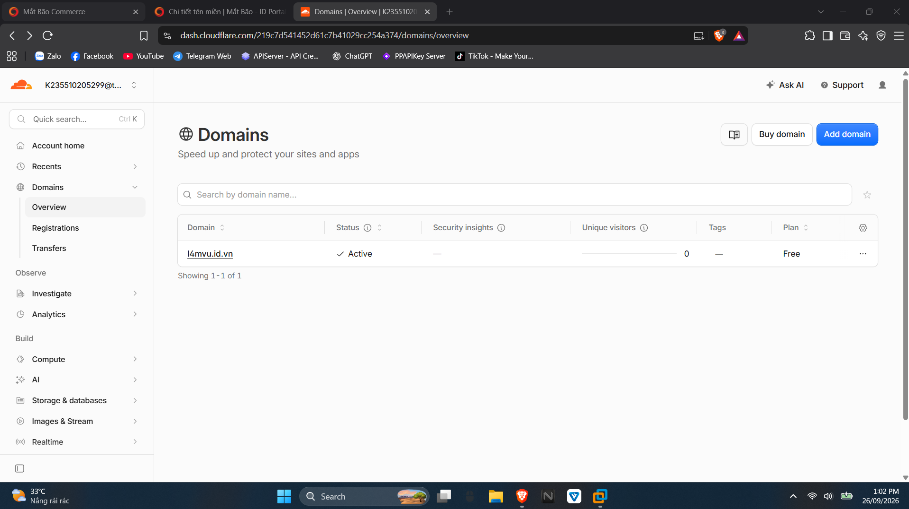
</p>

#### 3.5.3. Kiểm tra Nameserver

Sử dụng DNS của Cloudflare `1.1.1.1` để kiểm tra Nameserver của tên miền:

```bash
nslookup -type=NS l4mvu.id.vn 1.1.1.1
```

Kết quả trả về hai Nameserver:

```text
lucy.ns.cloudflare.com
quentin.ns.cloudflare.com
```

Điều này xác nhận tên miền đã sử dụng hệ thống DNS của Cloudflare.

<p align="center">
  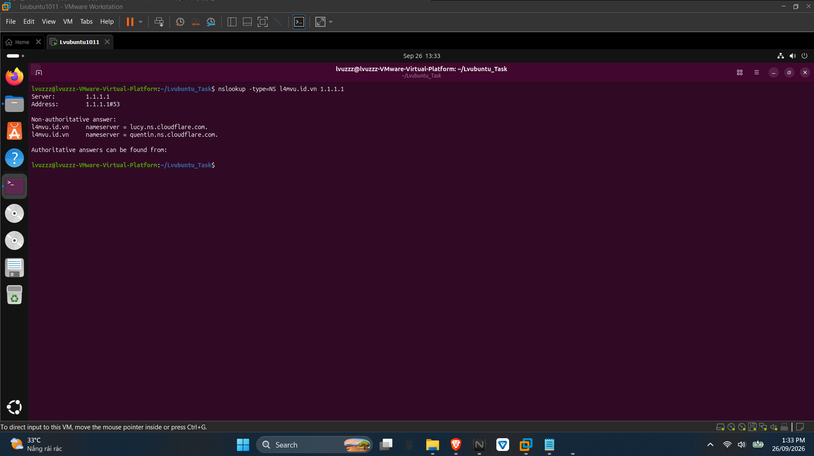
</p>

#### 3.5.4. Tạo Cloudflare Tunnel

Tạo một Cloudflare Tunnel với tên:

```text
lvubuntu-tunnel
```

Cloudflare Tunnel được sử dụng để tạo kết nối giữa hệ thống Docker trong máy ảo Ubuntu và Cloudflare.

Môi trường chạy Tunnel được lựa chọn là Docker để phù hợp với hệ thống đang triển khai bằng Docker Compose.

<p align="center">
  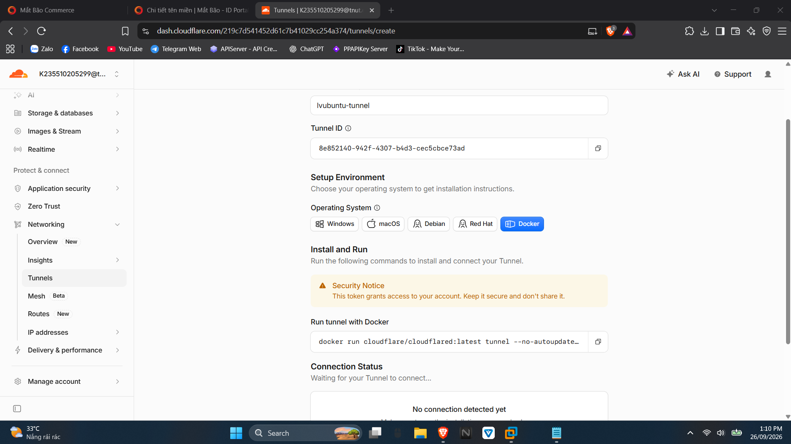
</p>

Sau khi container kết nối thành công, Tunnel chuyển sang trạng thái `Healthy`.

<p align="center">
  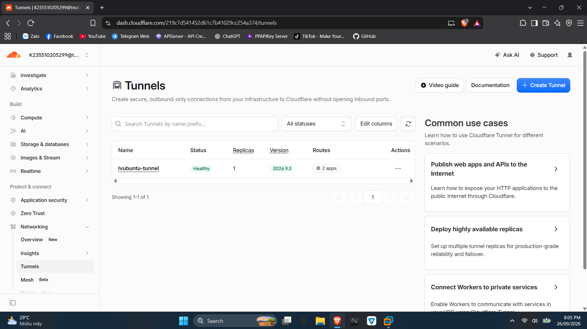
</p>

#### 3.5.5. Thêm Cloudflare vào Docker Compose

Dịch vụ Cloudflare được thêm vào file `compose.yaml` và sử dụng Tunnel Token được lưu trong file `.env`.

Khởi chạy lại các dịch vụ:

```bash
docker compose up -d
```

Kiểm tra trạng thái:

```bash
docker compose ps
```

Kết quả cho thấy Cloudflare cùng các dịch vụ Nginx, Node-RED, MariaDB và phpMyAdmin đều đang hoạt động.

<p align="center">
  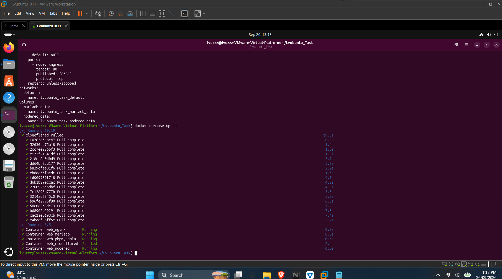
</p>

#### 3.5.6. Cấu hình route cho website

Tạo Published Application để đưa website đang chạy trên Nginx ra Internet.

Hostname của website thứ nhất:

```text
web1.l4mvu.id.vn
```

Service trong mạng Docker:

```text
http://nginx:80
```

Cloudflare tự động tạo bản ghi DNS và chuyển các request từ hostname trên đến Nginx thông qua Tunnel.

<p align="center">
  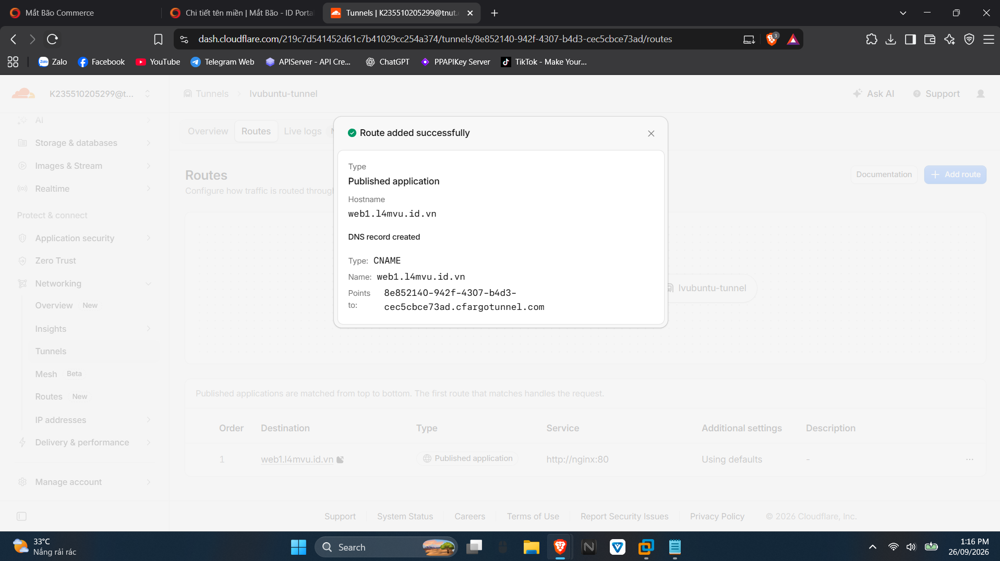
</p>

#### 3.5.7. Kiểm tra website qua Cloudflare Tunnel

Sau khi cấu hình Tunnel và Nginx, website có thể được truy cập trực tiếp bằng tên miền:

```text
https://web1.l4mvu.id.vn
```

Kết quả cho thấy Website 1 được Nginx phục vụ thành công thông qua Cloudflare Tunnel.

<p align="center">
  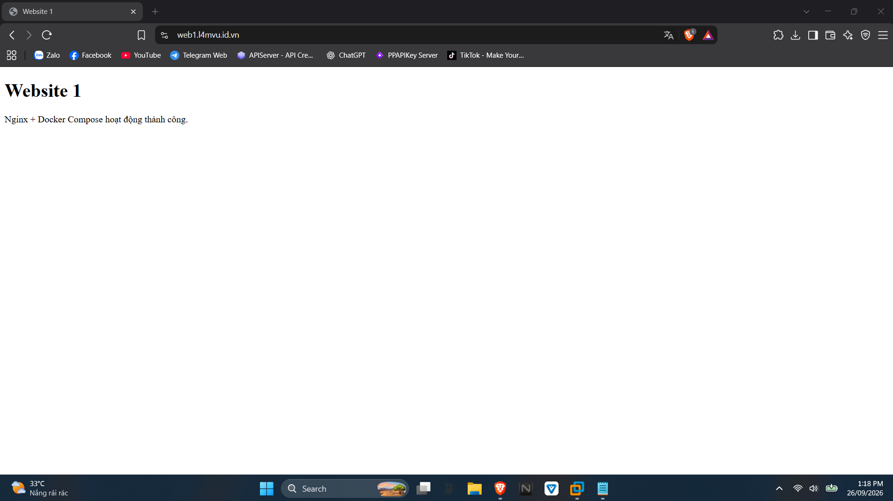
</p>

---

## 4. Cấu hình Nginx chạy 2 website với 2 tên miền khác nhau

Nginx được cấu hình để chạy hai website riêng biệt trên cùng một Web Server. Mỗi website sử dụng một tên miền khác nhau và được định tuyến thông qua Cloudflare Tunnel.

Hai tên miền được sử dụng:

```text
web1.l4mvu.id.vn
web2.l4mvu.id.vn
```

### 4.1. Cấu hình hai website trên Nginx

Trong file `nginx/default.conf`, hai khối `server` được cấu hình với hai `server_name` khác nhau.

Website 1 sử dụng:

```text
web1.l4mvu.id.vn
```

và lấy nội dung từ thư mục:

```text
/var/www/website1
```

Website 2 sử dụng:

```text
web2.l4mvu.id.vn
```

và lấy nội dung từ thư mục:

```text
/var/www/website2
```

Cấu hình này giúp Nginx xác định website cần trả về dựa trên tên miền mà người dùng truy cập.

<p align="center">
  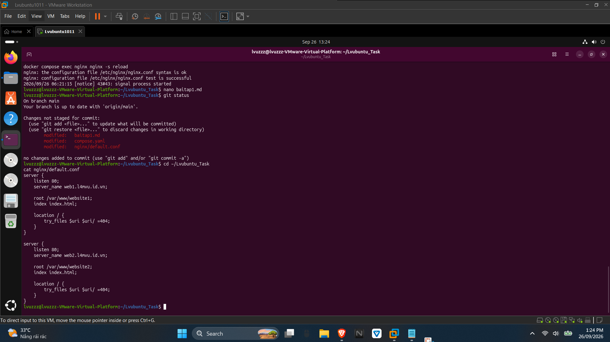
</p>

### 4.2. Kiểm tra cấu hình Nginx

Sau khi cấu hình hai tên miền, sử dụng lệnh sau để kiểm tra cú pháp của Nginx:

```bash
docker compose exec nginx nginx -t
```

Kết quả:

```text
syntax is ok
test is successful
```

cho thấy file cấu hình Nginx hợp lệ và có thể sử dụng.

<p align="center">
  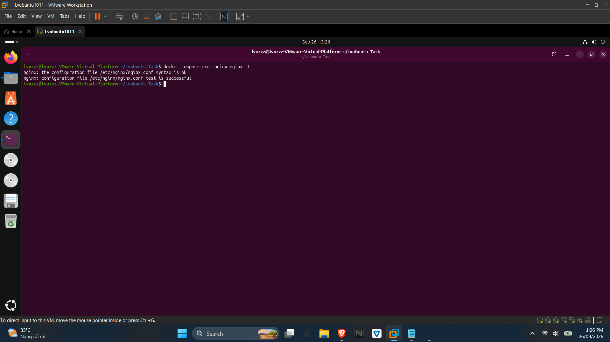
</p>

### 4.3. Kiểm tra Website 1

Truy cập Website 1 bằng tên miền:

```text
https://web1.l4mvu.id.vn
```

Website 1 được Nginx phục vụ thành công thông qua Cloudflare Tunnel.

<p align="center">
  
</p>

### 4.4. Kiểm tra Website 2

Truy cập Website 2 bằng tên miền:

```text
https://web2.l4mvu.id.vn
```

Website 2 hiển thị nội dung khác với Website 1, chứng minh Nginx có thể phân biệt tên miền và phục vụ hai website riêng biệt trên cùng một hệ thống.

<p align="center">
  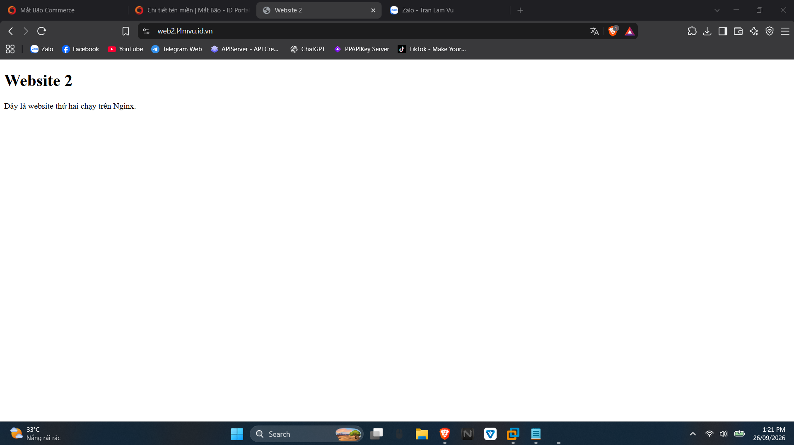
</p>

### 4.5. Kết quả

Sau khi hoàn thành cấu hình, hệ thống đã chạy thành công hai website với hai tên miền khác nhau:

- `web1.l4mvu.id.vn` → Website 1
- `web2.l4mvu.id.vn` → Website 2

Cả hai website đều được xử lý bởi Nginx trong Docker và có thể truy cập từ Internet thông qua Cloudflare Tunnel.
