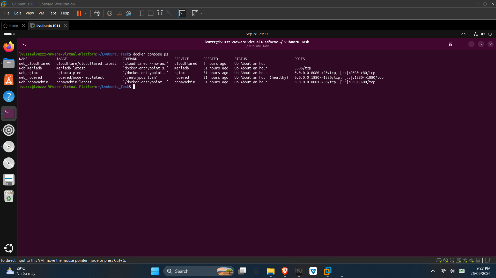
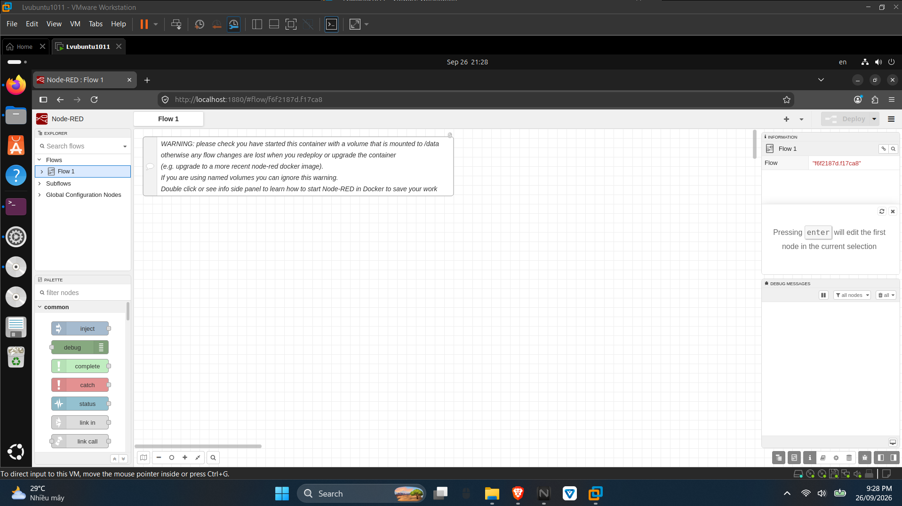
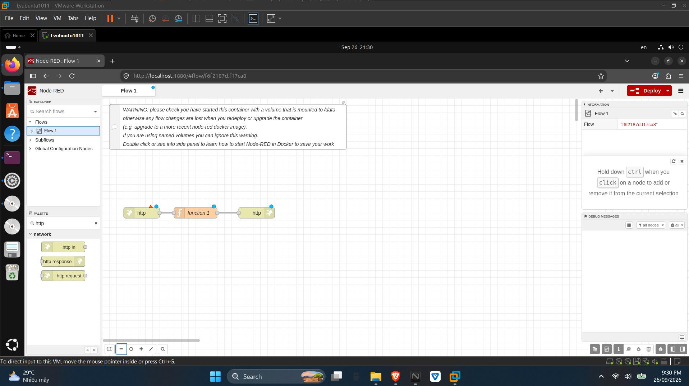
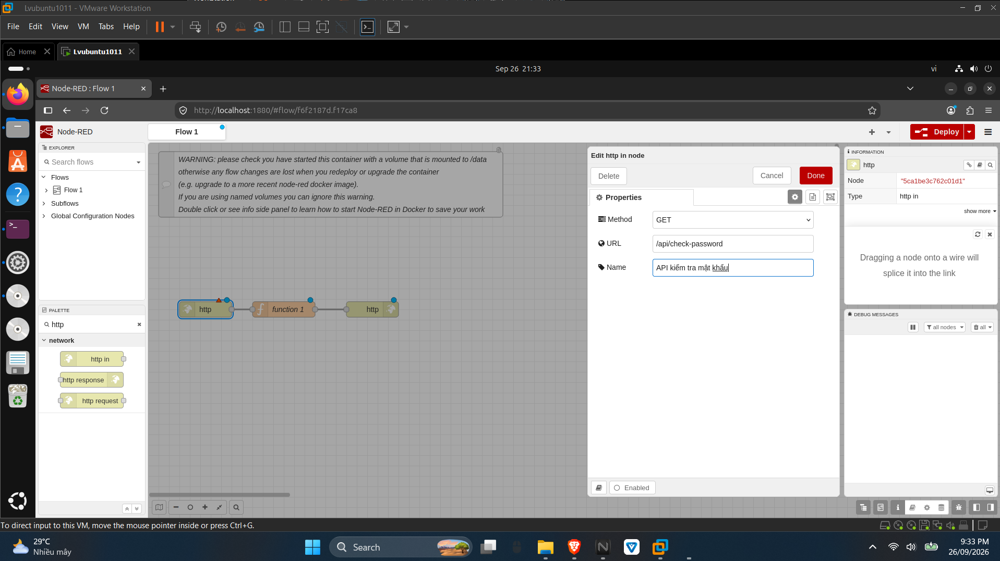
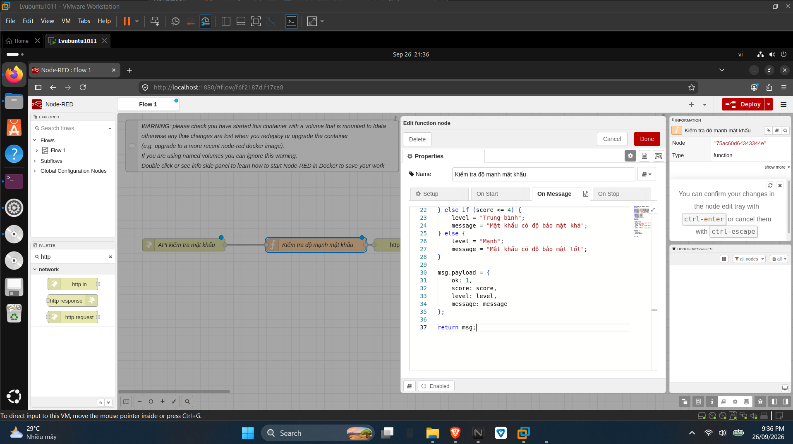
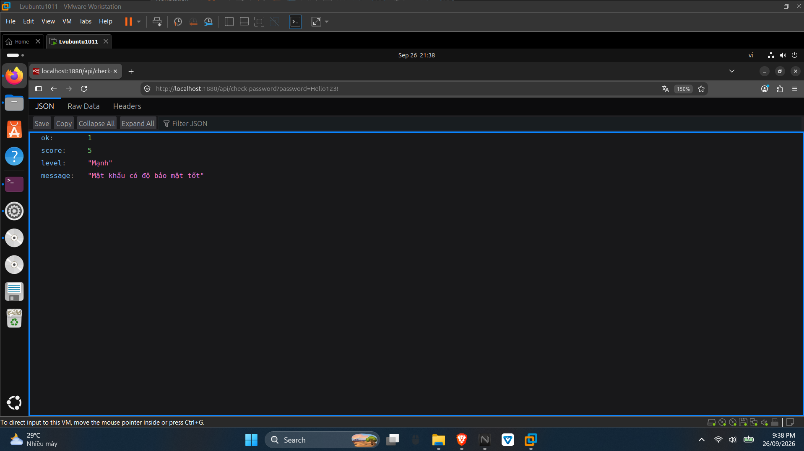
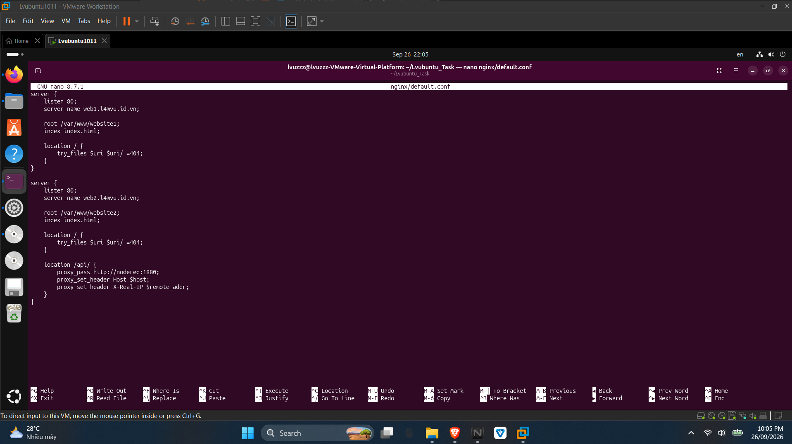
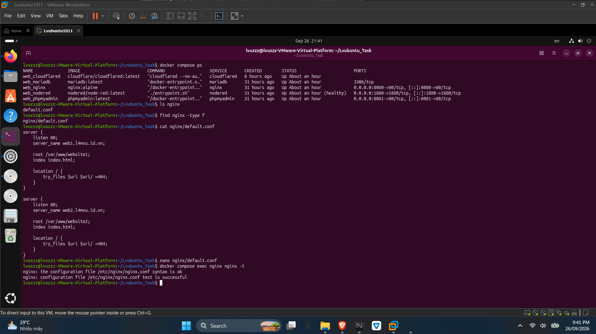
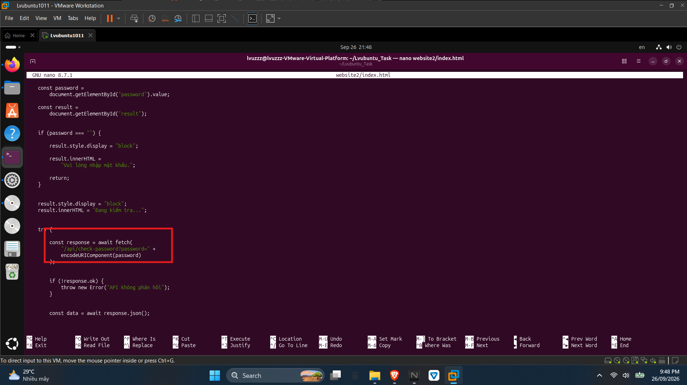
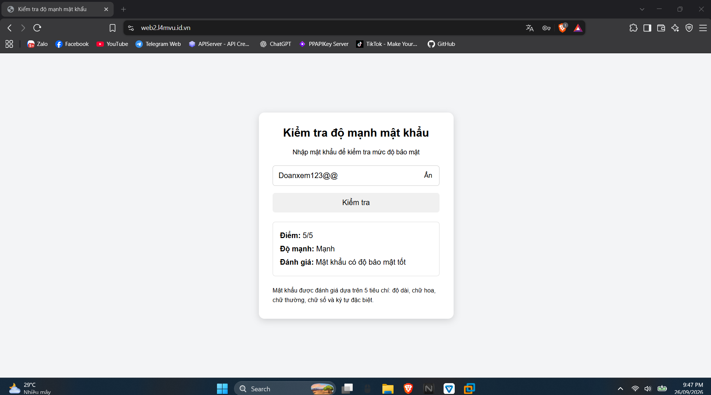

# BÀI TẬP 2

Bài tập thực hành xây dựng API kiểm tra độ mạnh mật khẩu bằng Node-RED, cấu hình Nginx để website có thể kết nối tới API và sử dụng JavaScript để gửi dữ liệu, nhận kết quả JSON và hiển thị trực tiếp trên giao diện.

## 1. Kiểm tra hệ thống Docker Compose

Trước khi thực hiện Bài tập 2, kiểm tra trạng thái các container đã được triển khai từ Bài tập 1.

```bash
docker compose ps
```

Các dịch vụ Nginx, Node-RED, MariaDB, phpMyAdmin và Cloudflared đều đang hoạt động.



## 2. Tạo API trên Node-RED

Truy cập giao diện Node-RED thông qua địa chỉ:

```text
http://localhost:1880
```

Node-RED đang hoạt động và có thể truy cập trực tiếp từ trình duyệt trên Ubuntu.



### 2.1. Tạo luồng xử lý API

Sử dụng ba node `http in`, `function` và `http response` để xây dựng API kiểm tra độ mạnh mật khẩu.

Luồng xử lý:

```text
http in → function → http response
```

Trong đó:

- `http in`: nhận yêu cầu kiểm tra mật khẩu.
- `function`: phân tích mật khẩu và tính điểm.
- `http response`: trả kết quả về dưới dạng JSON.



### 2.2. Cấu hình HTTP In

Node `http in` được sử dụng để tiếp nhận request gửi đến API.

Phương thức:

```text
GET
```

Đường dẫn API:

```text
/api/check-password
```

Mật khẩu cần kiểm tra được truyền vào thông qua tham số `password`.

Ví dụ:

```text
/api/check-password?password=Hello123!
```



### 2.3. Xây dựng thuật toán kiểm tra mật khẩu

Node `function` nhận mật khẩu từ request và kiểm tra lần lượt 5 tiêu chí:

- Có ít nhất 8 ký tự.
- Có chữ cái viết hoa.
- Có chữ cái viết thường.
- Có chữ số.
- Có ký tự đặc biệt.

Mỗi tiêu chí thỏa mãn được cộng 1 điểm. Tổng điểm tối đa là 5.

Mức độ mật khẩu được xác định như sau:

- Từ 0 đến 2 điểm: Yếu.
- Từ 3 đến 4 điểm: Trung bình.
- Đạt 5 điểm: Mạnh.

Sau khi xử lý, Function tạo dữ liệu kết quả và chuyển tới node `http response`.



### 2.4. Kiểm tra API Node-RED

Sau khi hoàn thành luồng xử lý, nhấn `Deploy` để áp dụng thay đổi.

API được kiểm tra trực tiếp trên trình duyệt bằng địa chỉ:

```text
http://localhost:1880/api/check-password?password=Hello123!
```

Với mật khẩu `Hello123!`, API trả về dữ liệu JSON tương ứng:

```json
{
  "ok": 1,
  "score": 5,
  "level": "Mạnh",
  "message": "Mật khẩu có độ bảo mật tốt"
}
```

Điều này cho thấy request đã được Node-RED tiếp nhận, Function xử lý thành công và kết quả được trả về thông qua `http response`.



## 3. Cấu hình Nginx kết nối với Node-RED

Để website có thể gọi API mà không cần truy cập trực tiếp cổng `1880`, Nginx được cấu hình làm trung gian chuyển tiếp request tới Node-RED.

Trong cấu hình của website, thêm đường dẫn `/api/` và chuyển tiếp request tới dịch vụ Node-RED:

```nginx
location /api/ {
    proxy_pass http://nodered:1880;
    proxy_set_header Host $host;
    proxy_set_header X-Real-IP $remote_addr;
}
```



Sau khi thay đổi cấu hình, kiểm tra cú pháp Nginx bằng lệnh:

```bash
docker compose exec nginx nginx -t
```

Nếu cấu hình không có lỗi, Nginx thông báo kiểm tra thành công.



Tiến hành reload Nginx để áp dụng cấu hình mới:

```bash
docker compose exec nginx nginx -s reload
```

Sau bước này, các request có đường dẫn `/api/` từ website sẽ được Nginx chuyển tiếp tới Node-RED.

## 4. Viết JavaScript gọi API từ website

Website 2 được thay đổi thành giao diện kiểm tra độ mạnh mật khẩu.

Người dùng có thể:

- Nhập mật khẩu cần kiểm tra.
- Hiện hoặc ẩn nội dung mật khẩu.
- Nhấn nút `Kiểm tra` để gửi yêu cầu.
- Xem điểm và mức độ bảo mật ngay trên website.

JavaScript sử dụng `fetch()` để gửi mật khẩu tới API:

```javascript
const response = await fetch(
    "/api/check-password?password=" +
    encodeURIComponent(password)
);

const data = await response.json();
```

`encodeURIComponent()` được sử dụng để mã hóa giá trị mật khẩu trước khi đưa vào URL.

Sau khi API trả dữ liệu JSON, JavaScript lấy các giá trị `score`, `level` và `message` để hiển thị kết quả lên giao diện.



## 5. Kiểm tra website gọi API

Truy cập Website 2 thông qua tên miền đã cấu hình.

Người dùng nhập mật khẩu vào ô kiểm tra và nhấn nút `Kiểm tra`.

Quá trình xử lý diễn ra theo thứ tự:

```text
Người dùng nhập mật khẩu
        ↓
JavaScript gửi request
        ↓
Nginx nhận request /api/
        ↓
Node-RED xử lý mật khẩu
        ↓
API trả dữ liệu JSON
        ↓
JavaScript nhận kết quả
        ↓
Website hiển thị đánh giá
```

Khi nhập mật khẩu đáp ứng đầy đủ 5 tiêu chí, website hiển thị số điểm, mức độ mạnh và nội dung đánh giá tương ứng.



## 6. Kết quả

Bài tập đã xây dựng thành công API kiểm tra độ mạnh mật khẩu bằng Node-RED với các node `http in`, `function` và `http response`.

API có khả năng nhận mật khẩu, kiểm tra 5 tiêu chí và trả kết quả dưới dạng JSON.

Nginx được sử dụng để chuyển tiếp request từ website tới Node-RED. JavaScript trên trang HTML sử dụng `fetch()` để gọi API, nhận dữ liệu trả về và hiển thị kết quả trực tiếp trên giao diện.

Ngoài chức năng kiểm tra độ mạnh, giao diện còn hỗ trợ hiện hoặc ẩn mật khẩu để thuận tiện khi sử dụng.

Luồng hoạt động hoàn chỉnh của hệ thống:

```text
Website
   ↓
JavaScript fetch()
   ↓
Nginx
   ↓
Node-RED API
   ↓
Function kiểm tra mật khẩu
   ↓
JSON
   ↓
Website hiển thị kết quả
```
